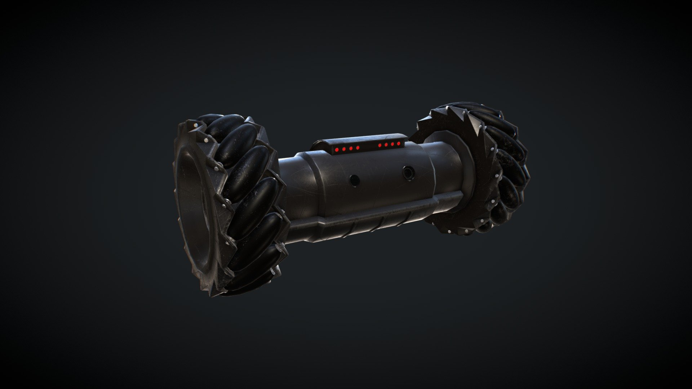
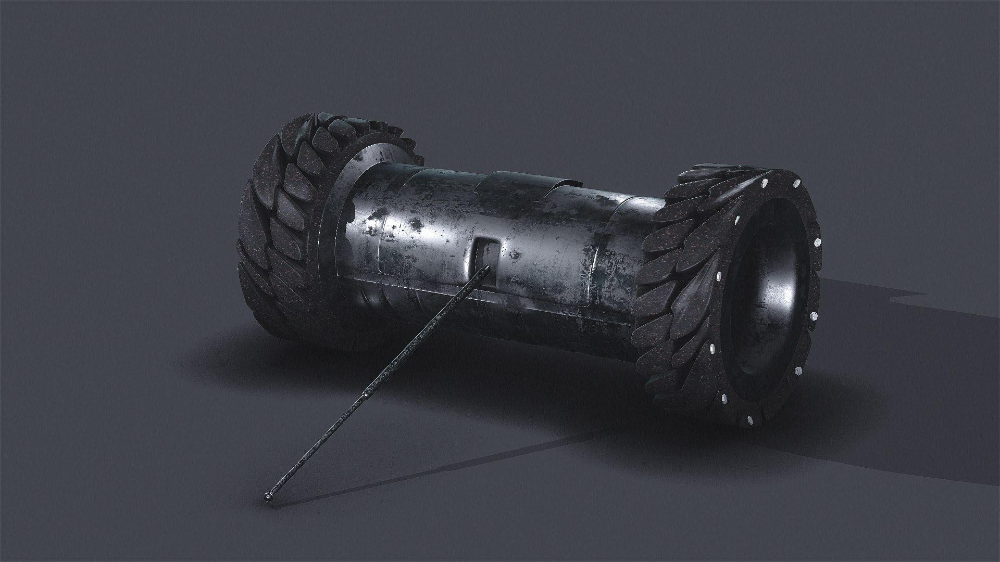

# R6S Recon Scout — Analog FPV Ground Robot

A miniature differential-drive ground robot inspired by the Recon Scout from Rainbow Six Siege, built around analog 5.8GHz FPV drone components for zero-latency video and long-range RC control.

## Project Overview

**Goal:** Build a functional miniature FPV ground robot matching the dumbbell form factor of the R6S Recon Scout, using off-the-shelf drone electronics for real-world performance.

**Why This Project:**
- Apply drone electronics knowledge to a ground robotics platform
- Achieve true zero-latency analog FPV video on a custom-built robot
- Design and 3D print a compact dumbbell chassis from scratch
- Document the full hardware integration process — wiring, ESC flashing, TX configuration
- Build a fun, capable RC robot as a counterpart to more software-heavy portfolio projects

## Hardware Platform

### Core Components
- **Chassis:** Custom 3D-printed dumbbell form factor (PETG body, TPU wheel treads)
- **Drive Motors:** 2× 1104 Brushless Motor 4300KV (2S rated)
- **ESCs:** 2× BLHeli-S 20A ESC (2–4S, flashed to bidirectional mode)
- **Receiver:** FlySky FS-iA6B (6CH, AFHDS 2A, iBUS/PPM)
- **Transmitter:** FlySky FS-i6X (10CH, AFHDS 2A — operator-owned)
- **Camera + VTX:** AKK KC04 5.8GHz 40CH 600mW, 700TVL, 2.8mm 120° FPV (operator-owned)
- **FPV Goggles:** 5.8GHz receiver goggles (operator-owned)
- **Power:** 2S LiPo (operator-owned, ×2 — one active, one spare)

### Technical Specifications

| Component | Specification |
|-----------|---------------|
| **Form Factor** | Dumbbell — two wheel hubs, central barrel, rear stabilizer stem |
| **Barrel Diameter** | TBD |
| **Total Width** | TBD |
| **Drivetrain** | Differential steering, 2WD brushless |
| **Motor KV** | 4300KV |
| **Battery** | 2S LiPo, 7.4V nominal, 800mAh, 50C, JST connector |
| **ESC Protocol** | DSHOT / BLHeli-S, bidirectional mode enabled |
| **RC Protocol** | AFHDS 2A (2.4GHz) |
| **Video Protocol** | Analog 5.8GHz, 40 channels, 600mW |
| **Video Latency** | ~0ms (analog) |
| **Camera FOV** | 120° |
| **Camera Resolution** | 700TVL |
| **Telemetry** | Battery voltage via AFHDS 2A back-channel |

### Power Architecture

| Component | Power Source |
|-----------|-------------|
| ESCs | 2S LiPo main lead |
| Receiver | ESC BEC (5V regulated) |
| AKK KC04 VTX + Camera | 2S LiPo direct (5–12V input range) |

### Bill of Materials

| Item | Qty | Unit Price | Total |
|------|-----|-----------|-------|
| FlySky FS-iA6B Receiver | 1 | $29.99 | $29.99 |
| 1104 Brushless Motor 4300KV | 4 (2 used, 2 spare) | — | $40.66 |
| BLHeli-S 20A ESC 2–4S | 2 | $19.98 | $39.96 |
| 90W Soldering Iron + Heat Set Insert Kit | 1 | $35.99 | $35.99 |
| M1.4–M3 Screw Assortment (810 pcs) | 1 | $16.99 | $16.99 |
| PETG Filament (black) | ~200g | — | on hand |
| TPU 95A Filament | ~50g | — | on hand |
| Silicone Wire 24AWG | — | — | on hand |
| Heat Shrink Assortment | — | — | on hand |
| XT30/XT60 Connectors | — | — | on hand |
| FlySky FS-i6X Transmitter | 1 | — | operator-owned |
| AKK KC04 FPV Camera + VTX | 1 | — | operator-owned |
| FPV Goggles (5.8GHz) | 1 | — | operator-owned |
| 2S 800mAh 50C LiPo (JST + PH2.0) | 2 | — | operator-owned |
| **Total (purchased)** | | | **~$163.59** |

## Chassis Design

The robot matches the R6S Recon Scout's dumbbell silhouette:

- **Wheel hubs:** Each hub houses one 1104 motor directly. TPU tread ring press-fits onto a PETG hub.
- **Barrel:** Central ~40mm diameter cylinder containing the ESCs, receiver, and all wiring. The AKK KC04 camera lens faces forward through the barrel front face.
- **Rear stem:** Fixed passive stabilizer leg with a ball tip, prevents tipping during hard acceleration. Attaches to the barrel via M2 heat-set insert joint.

## Transmitter Configuration (FlySky FS-i6X)

### Binding
1. Power on receiver in bind mode (hold bind button)
2. On i6X: Menu → **RX Bind** → follow prompts

### Mixer Setup (Differential Steering)
Navigate to **Aux. Channels** or **Mixer** on the i6X and configure elevon/differential mix:
- **Left stick Y-axis** → both ESCs (forward/reverse)
- **Left stick X-axis** → differential (left/right turn by speed difference)

No flight controller or microcontroller required — all mixing is handled in the transmitter.

### Telemetry
Battery voltage is read back from the FS-iA6B over AFHDS 2A and displayed on the i6X screen. Monitor this to avoid over-discharging the LiPo.

## Current Status

**Last Updated:** March 2026

Project is in the hardware acquisition phase. All electronics have been purchased and are arriving by March 16th. 3D printing and assembly to follow.

### Completed Milestones

**Planning & Design:**
- ✅ System architecture defined — pure analog FPV, no onboard computer
- ✅ Motor and ESC selection finalized (1104 4300KV + BLHeli-S bidirectional)
- ✅ Receiver selected (FS-iA6B, confirmed AFHDS 2A telemetry support)
- ✅ Chassis concept designed — dumbbell form factor matching R6S reference
- ✅ Full BOM sourced and purchased

**Pending:**
- ⏳ Hardware delivery (by March 16th)
- ⏳ ESC bidirectional flashing
- ⏳ Transmitter binding and mixer configuration
- ⏳ Wheel hub 3D model — shaft diameter verification pending (1.5mm vs 2mm)
- ⏳ Barrel and stem 3D model
- ⏳ Full mechanical assembly
- ⏳ First drive test

### Known Design Considerations

- **Motor shaft diameter:** 1104 motors ship with either 1.5mm or 2mm shafts depending on variant. Wheel hub grub screw bore must match — verify before printing hubs.
- **ESC antenna clearance:** FS-iA6B antenna must not be enclosed in a solid PETG shell. Route antenna wire to exit through barrel wall or use an external-antenna variant.
- **VTX power:** AKK KC04 accepts 5–12V directly — wire to 2S main lead, not the BEC rail.
- **Battery connector:** The 2S 800mAh pack uses a **JST connector**. Make sure ESC power leads are terminated with a matching JST plug, or use a JST-to-XT30 adapter if your ESCs ship with XT30.
- **Motor direction:** One ESC set to `Bidirectional`, the other to `Bidirectional Reversed`. Getting this wrong results in one wheel driving backward — fix in BLHeli Configurator, not by swapping motor wires.

## Documentation

- [Bill of Materials](docs/hardware/bill-of-materials.md) — Complete parts list with suppliers and costs
- [Build Log](docs/logs/build-logs.md) — Session-by-session assembly and testing journal

## Author

**Arsham Faghihnasiri**

Building robots and learning real hardware engineering end-to-end.

- 📍 Greater Toronto Area, Ontario, Canada
- 💼 [LinkedIn](https://www.linkedin.com/in/arsham-faghihnasiri)
- 📧 arshamfaghihnasiri@gmail.com
- 🎓 Software Engineering

## License

[Creative Commons Attribution-NonCommercial 4.0 International (CC BY-NC 4.0)](LICENSE)

You are free to share and adapt this project for personal and non-commercial use with attribution. Commercial use of this design or derivatives requires explicit written permission from the author.
