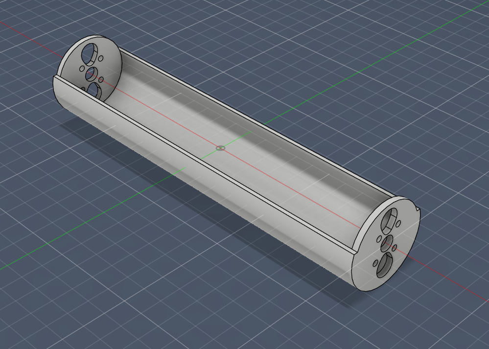

# Session 001 — Body Design v1

**Date:** 2026-03-17  
**Status:** ✅ Complete

---

## Goal

Design and print a first body to verify motor fitment and establish a physical
reference for the barrel geometry ahead of electronics integration.

---

## What Was Accomplished

1. First body designed in CAD around the 2212 920KV motor dimensions
2. Body printed in PLA — motor fitment confirmed
3. ESCs arrived during this session — body found to be significantly oversized
   against actual ESC dimensions

---

## Body Design — v1

The first body was designed in CAD and printed in PLA. The goal was not a final
part — PLA was chosen for print speed and low cost to verify geometry before
committing to engineering-grade filament. Motor fitment was confirmed: the 2212
920KV motors seat correctly in the hub geometry.

However, once the HSKRC OPTIO 20A ESCs arrived, it became clear the original
barrel internal volume estimate was based on incorrect ESC dimensions. The actual
ESCs are significantly smaller than anticipated, leaving the body oversized and
out of proportion with the target dumbbell silhouette.

The body will be redesigned around the actual ESC footprint in a future session
once the electronics integration approach is fully established.

---

## Next Steps

- [ ] Research correct software and hardware approach for ESC programming
- [ ] Redesign body around actual ESC dimensions
- [ ] Flash both ESCs to bidirectional mode
- [ ] Bind FS-iA6B receiver to FS-i6X transmitter
- [ ] Configure elevon mix on FS-i6X
