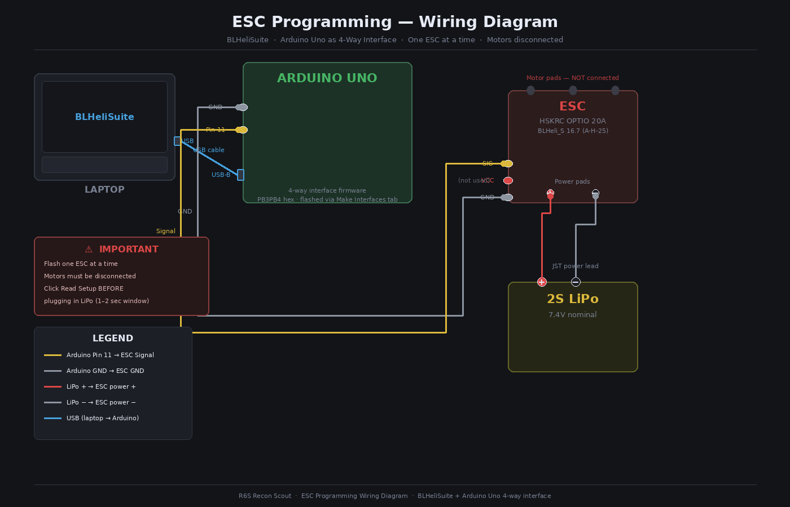

# Session 002 — ESC Programming Research & Arduino Interface Solution

**Date:** 2026-03-19  
**Status:** ✅ Complete

---

## Goal

Research and confirm the correct software and hardware approach for programming
the BLHeli_S ESCs in a no-flight-controller setup, and establish a working
interface method without purchasing dedicated hardware.

---

## What Was Accomplished

1. Confirmed that BLHeli Configurator is incompatible with direct ESC programming
   — it requires a flight controller in the signal path
2. Identified BLHeliSuite as the correct tool for direct ESC configuration
3. Identified the Arduino Uno as a viable 4-way interface, eliminating the need
   for a dedicated USB linker (~$30 CAD)
4. Confirmed the correct Arduino firmware and wiring for BLHeliSuite compatibility

---

## ESC Programming Research

The original plan documented in Session 000 assumed BLHeli Configurator could be
used for ESC configuration. BLHeli Configurator is the most commonly referenced
tool in BLHeli_S documentation, but it operates exclusively via flight controller
passthrough — it sends configuration commands through a flight controller's USB
port, which relays them to the ESC over its signal wire. Without a flight
controller in the chain, BLHeli Configurator has no path to the ESC and cannot
be used.

For a no-flight-controller ground robot setup, **BLHeliSuite** (Windows desktop
application) is the correct tool. BLHeliSuite supports direct ESC programming via
a 4-way interface, which handles the single-wire communication protocol used by
BLHeli_S ESCs.

---

## Arduino Uno as 4-Way Interface

The standard dedicated hardware for this role is a USB linker or 4-way interface
dongle, typically ~$30 CAD. Rather than purchasing additional hardware, an Arduino
Uno can be flashed with 4-way interface firmware and used in its place at zero
additional cost.

BLHeliSuite includes a Make Interfaces tab specifically for this purpose. The
correct firmware for the Uno is the PB3PB4 variant —
`4wArduino_m328P_16_PB3PB4v20006.hex`. The MULTI hex was also tested and did not
work. Once flashed, the ESC signal wire connects to Arduino pin 11, and BLHeliSuite
communicates with the ESC through the Uno over USB.

**Interface selection in BLHeliSuite:** SILABS BLHeli Bootloader (4way-if)

This approach reused hardware already on hand and avoided a $30 purchase.

---

## Next Steps

- [ ] Flash Arduino Uno with PB3PB4 firmware via BLHeliSuite Make Interfaces tab
- [ ] Flash both ESCs to bidirectional mode
- [ ] Bind FS-iA6B receiver to FS-i6X transmitter
- [ ] Configure elevon mix on FS-i6X
- [ ] Redesign body around actual ESC dimensions
