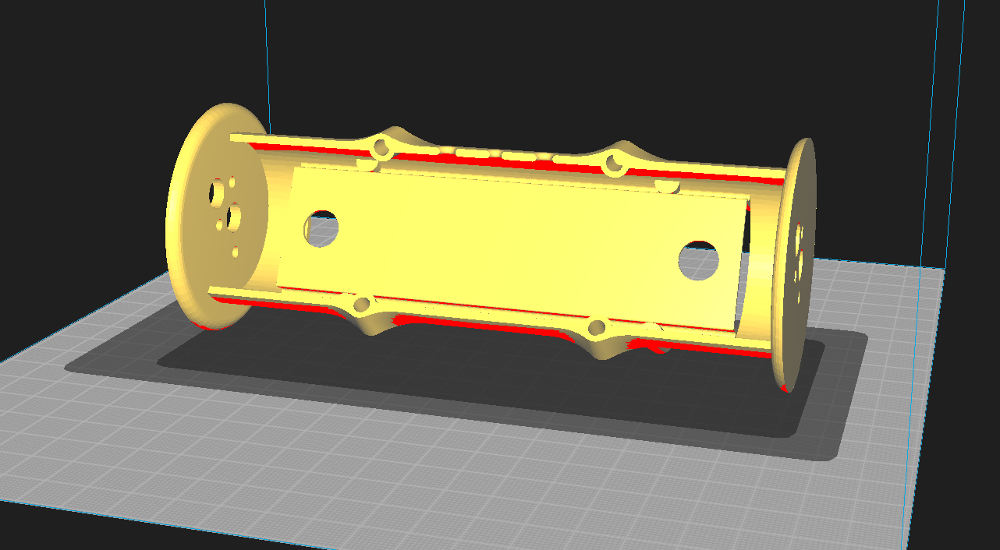

# Session 003 — ESC Flashing, Receiver Binding, Elevon Mix & Body Redesign

**Date:** 2026-03-21  
**Status:** ✅ Complete

---

## Goal

Execute the electronics configuration established in Session 002 — flash both ESCs,
bind the receiver, and configure the elevon mix. Redesign the body around the
actual ESC dimensions and produce a revised print.

---

## What Was Accomplished

1. Arduino Uno flashed with PB3PB4 4-way interface firmware via BLHeliSuite
2. Both ESCs flashed to bidirectional mode
3. FS-iA6B receiver bound to FS-i6X transmitter
4. Elevon mix configured on FS-i6X — differential steering bench-tested and
   confirmed working
5. Body redesigned around actual ESC footprint
6. Wiring diagram produced for the repository

---

## ESC Flashing

The Arduino Uno was flashed with the PB3PB4 firmware
(`4wArduino_m328P_16_PB3PB4v20006.hex`) via the Make Interfaces tab in BLHeliSuite
as established in Session 002. The ESC signal wire connects to Arduino pin 11.
Interface selection: SILABS BLHeli Bootloader (4way-if).

**Critical timing requirement:** Click Read Setup in BLHeliSuite first, then plug
in the LiPo within 1–2 seconds. The ESC bootloader window opens at power-on and
closes almost immediately — missing this window requires repowering the ESC and
retrying.

**ESC configuration:**
- ESC1 → Motor Direction: `Bidirectional`
- ESC2 → Motor Direction: `Bidirectional Reversed`

---

## Receiver Binding

Binding used the standard FS-iA6B bind plug method. The ESC BEC provided 5V to
the receiver during the bind sequence. Transmitter placed into bind mode via the
RX Bind menu. Bind completed on first attempt. Bind plug removed after binding.

---

## Elevon Mix Configuration

Elevon mix enabled on the FS-i6X for differential steering. The default travel
value within the elevon mix menu was 50% on both channels — this caused limited
throw and sluggish bench response. The fix was within the mix menu itself, not in
the endpoint/travel adjust settings.

**Final elevon mix settings:**
- CH1 and CH2 travel: 100%
- Rate: 100
- Expo: 70

**Control mapping:**
- Right stick Y axis — forward / reverse
- Right stick X axis — differential steering
- Left stick throttle Y axis — reserved for future variable speed limiter

The right stick is spring-loaded and self-centering. The left stick throttle axis
is non-spring-loaded and is reserved for a future variable speed limiter feature.
This feature cannot be implemented natively on the FS-i6X and would require a
microcontroller between the receiver and ESCs.

---

## Body Redesign

With the actual ESC dimensions confirmed on arrival, the body was redesigned to
match the real ESC footprint. The revised barrel is more compact and better
proportioned to the target dumbbell silhouette. This design will serve as the
basis for the PETG prints in the next session.

---

## Next Steps

- [ ] Print revised body, body cap, and battery cover in PETG
- [ ] Print wheels and rear stem in TPU
- [ ] Install heat set inserts
- [ ] Complete full wiring and assembly
