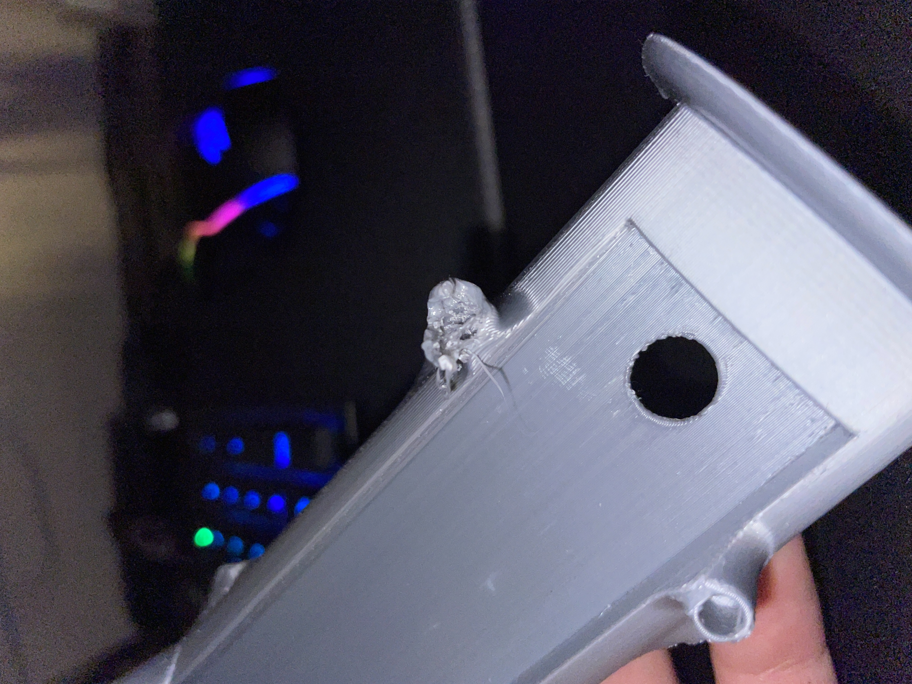
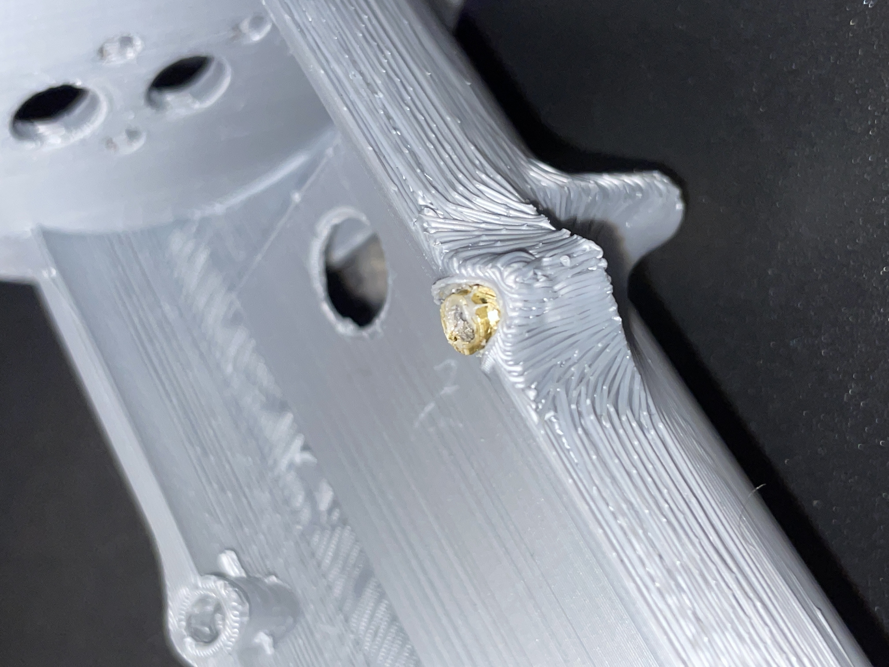
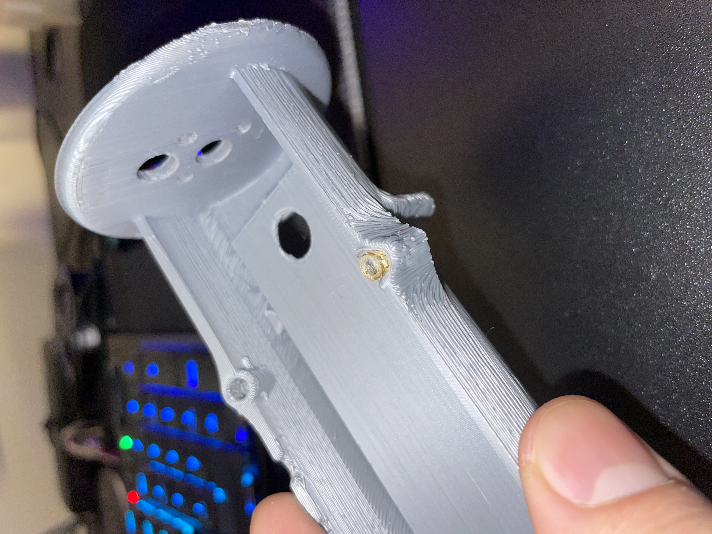

# Session 004 — Heat Set Insert Testing, PETG & TPU Prints

**Date:** 2026-03-23  
**Status:** ✅ Complete

---

## Goal

Install M3×6×5 brass heat set inserts into the redesigned body, identify and
resolve any fitment issues, reprint body components in PETG with corrected
geometry, and print wheels and rear stem in TPU.

---

## What Was Accomplished

1. Heat set insert installation attempted on PLA body — part destroyed, root
   causes identified
2. Correct cavity dimensions established through testing and research
3. Body, body cap, and battery cover redesigned with corrected cavity geometry
   and reprinted in PETG
4. Wheel design completed and printed in TPU
5. Rear stem printed in TPU

---

## Heat Set Insert Testing — PLA Failure

Heat set insert installation was attempted on the existing PLA body using M3×6×5
brass threaded inserts. The attempt failed and destroyed the part. Two root causes
were identified:

**1. Insufficient wall material around the cavity**
The original design had too little material surrounding the insert cavity. PLA
softens rapidly under heat — without adequate surrounding mass, the cavity walls
collapsed outward before the insert could be fully seated.

**2. PLA is unsuitable for heat set inserts at this wall thickness**
PLA has a low glass transition temperature (~60°C). At the soldering iron
temperatures required to melt the insert into the cavity, the surrounding PLA
collapses before the insert is fully seated. Soldering iron temperature was varied
during testing, but temperature was found to be a secondary factor — the primary
issue was the cavity geometry and material, not the iron setting. PETG (glass
transition ~80°C) provides meaningfully more working time and is the correct
material for this application.

---

## Corrected Heat Set Insert Cavity Specification

Through testing and research, the following cavity dimensions were established for
M3×6×5 brass threaded inserts:

| Parameter | Value | Rationale |
|-----------|-------|-----------|
| Cavity diameter | 4.2mm | Tight enough to grip, loose enough to seat without excessive force |
| Cavity depth | 7.2mm | 1.2mm deeper than insert length — accommodates displaced material below the insert |
| Outer wall diameter | 9.35mm | Sufficient surrounding material for the insert to grip and anchor into |

The original cavity diameter of 4.1mm and depth of 7mm were both insufficient.
The 0.1mm diameter increase reduces insertion force enough to allow the insert to
seat before the surrounding material collapses. The extra 0.2mm of depth prevents
displaced material from packing into the insert threads.

---

## Revised Body — PETG Prints

The body, body cap, and battery cover were redesigned with the corrected heat set
insert cavity geometry and printed in PETG. PETG was selected for its higher glass
transition temperature, better impact resistance compared to PLA, and adequate
layer adhesion for structural parts.

The four-piece body structure is as follows:

| Piece | Material | Function |
|-------|----------|----------|
| Main Body | PETG | Primary electronics housing |
| Main Body Cap | PETG | Forward face — mounts AKK BA3 and antennas |
| Battery Cover | PETG | Removable panel, frequent-access battery compartment |
| Rear Stem | TPU | Passive stabilizer leg |

---

## Wheels & Rear Stem — TPU Prints

A new wheel design was completed and printed in TPU. TPU was selected for the
wheels and rear stem for its flexibility and grip characteristics on hard surfaces.
The rear stem was printed in TPU to allow it to flex on impact rather than
fracture.

---

## Next Steps

- [ ] Install heat set inserts into PETG body parts
- [ ] Solder all electronics
- [ ] Complete full assembly
- [ ] First drive test
