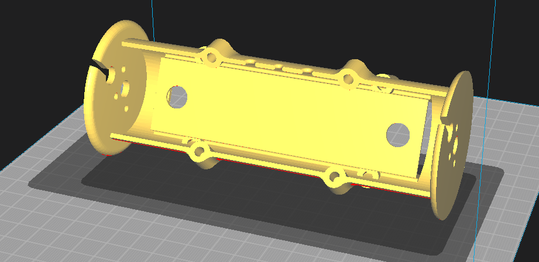
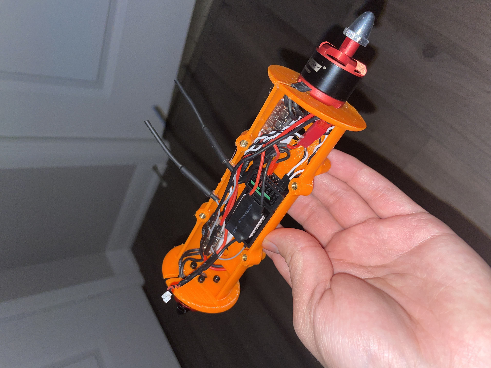
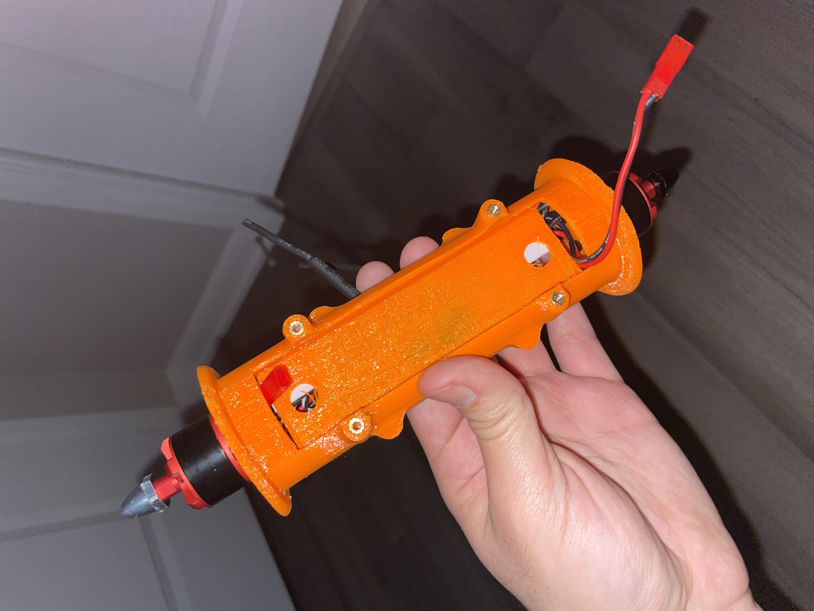
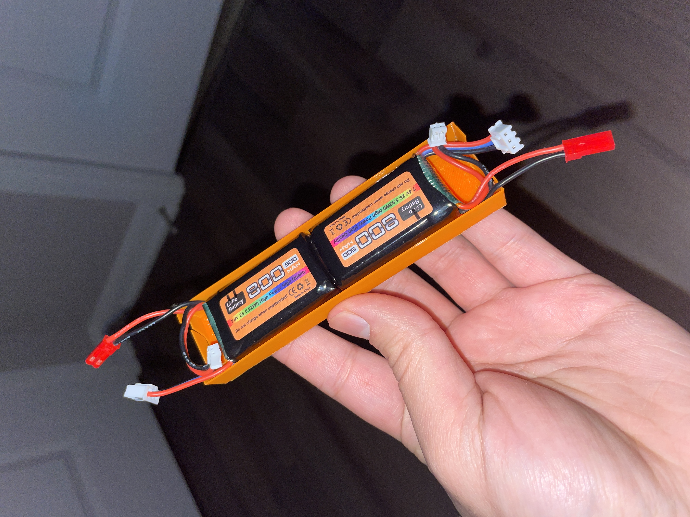
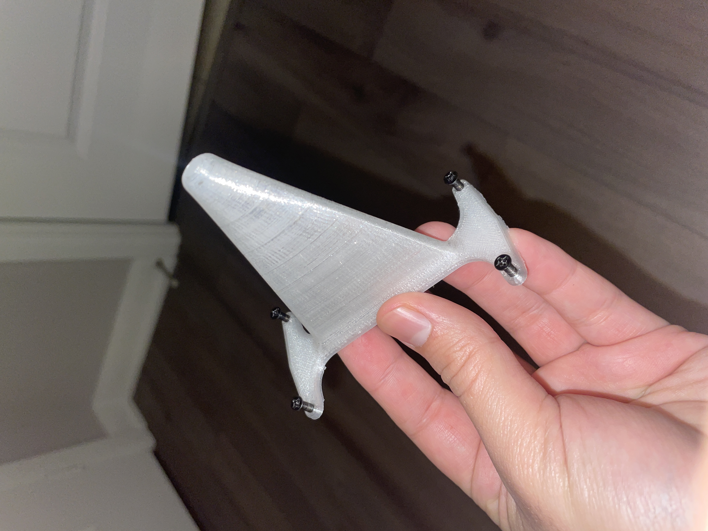
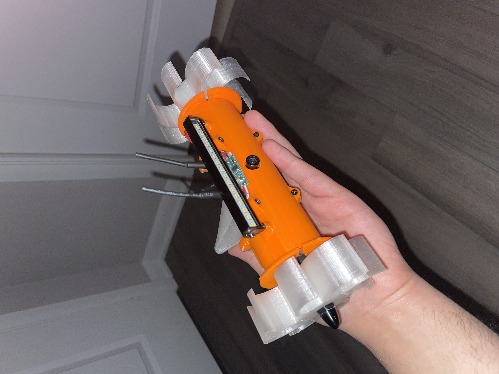
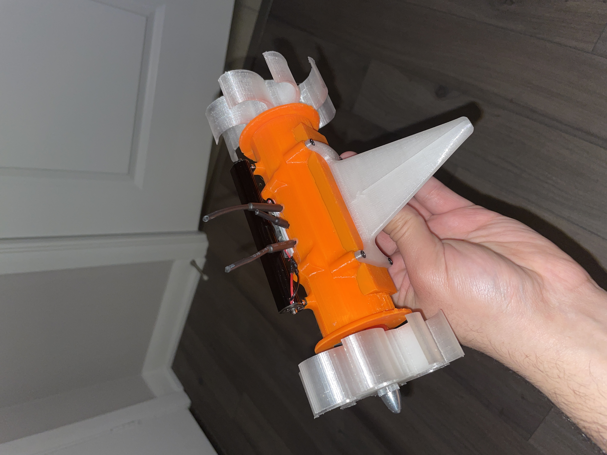

# Session 005 — Full Assembly, First Drive Test & ESC Tuning

**Date:** 2026-03-25  
**Status:** ✅ Complete

---

## Goal

Complete full mechanical and electrical assembly, perform the first drive test,
and resolve any issues encountered.

---

## What Was Accomplished

1. Heat set inserts installed into PETG body parts
2. All electronics soldered and wired
3. Full assembly completed — wheels, stem, body cap, and battery cover all attached
4. First drive test performed — motors clicking with no forward motion
5. Root cause identified: ESC startup parameters mismatched for direct-drive wheel
   application
6. ESC startup parameters tuned in BLHeliSuite — motor torque issue resolved
7. ESC PWM calibration performed — incorrect PPM values corrected
8. Deadband increased — motor spin at zero throttle resolved
9. Second drive test performed — robot moves under power
10. New issues identified: excessive speed, near-zero traction, inconsistent motor
    behaviour

---

## Assembly

Heat set inserts were installed into all PETG body parts using the cavity
dimensions established in Session 004. All electronics were soldered and wired
according to the wiring diagram. Components were installed into the main body,
the body cap screwed on, the battery cover attached, and the wheels and rear stem
fitted.

---

## First Drive Test — Motor Torque Failure

On first power-up, both motors produced only a clicking sound and failed to spin.
The ESCs were restarting under load rather than driving the motors.

**Root cause:** The default BLHeli_S ESC startup parameters are tuned for drone
propeller applications — low inertia loads that spin up quickly from rest.
Direct-drive wheels on a ground robot present a high-inertia, high-friction load
at startup. The default Low RPM Power Protect setting actively limits power at
low RPM to protect drone motors, which prevents the ESC from delivering enough
current to overcome the static friction and inertia of the loaded wheel.

**Resolution — BLHeliSuite parameter changes:**

| Parameter | Previous Value | New Value | Reason |
|-----------|---------------|-----------|--------|
| Low RPM Power Protect | On | Off | Was actively suppressing startup current |
| Startup Power | Default | High | Increases current available at zero RPM |
| Demag Compensation | Default | Low | Reduces conservative commutation behaviour at startup |
| Motor Timing | Default | High | Improves commutation efficiency at low RPM under load |

These changes resolved the torque issue. Both motors spun up and drove the robot
forward without a motor swap or any hardware change.

---

## ESC PWM Calibration — Incorrect PPM Values

After the torque fix, one motor was running faster than the other and both motors
showed spin at zero throttle. Investigation revealed that the ESCs had learned
incorrect PPM throttle values during a prior calibration attempt.

**Incorrect learned values:** Min 1148µs / Center 1488µs / Max 1832µs  
**Correct values for FS-i6X output:** Min 1000µs / Center 1500µs / Max 2000µs

The correct values were entered manually in BLHeliSuite. With an accurate center
point, the ESCs correctly identify zero throttle.

---

## Deadband — Motor Spin at Zero Throttle

With the corrected PPM values in place, residual motor jitter at stick center was
addressed by increasing the Deadband value in BLHeliSuite. The deadband defines
a dead zone around the center PPM point within which the ESC outputs zero drive
signal. Increasing this value prevents minor stick imprecision or signal noise from
causing unintended motor movement at rest.

---

## Second Drive Test — Speed and Traction Issues

With the torque and calibration fixes applied, the robot moved under power for the
first time. Three issues were immediately apparent:

**1. Excessive speed**
The robot accelerated far beyond a controllable speed for an indoor environment.
920KV motors on 2S with 90mm wheels produce more top speed than can be managed
meaningfully in a confined space.

**2. Near-zero traction**
The TPU wheels provided almost no traction on the test surface. The robot spun its
wheels in place rather than converting speed into forward motion. The current wheel
geometry — large diameter, relatively narrow contact patch — does not generate
sufficient grip.

**3. Inconsistent motor behaviour**
The two motors do not respond at the same speed or at the same time across the
throttle range. The mismatch compounds the traction problem and makes directional
control unreliable.

All three issues together make the robot uncontrollable in its current state.
These will be investigated and addressed in Session 006.

---

## Next Steps

- [ ] Investigate motor response inconsistency — ESC calibration, signal path,
      or mechanical cause
- [ ] Design new wheels — smaller diameter, wider contact patch, better traction
      geometry
- [ ] Reprint wheels in TPU
- [ ] Retest with revised wheels
